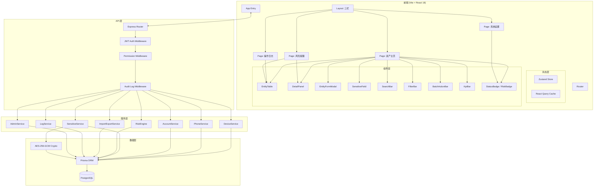
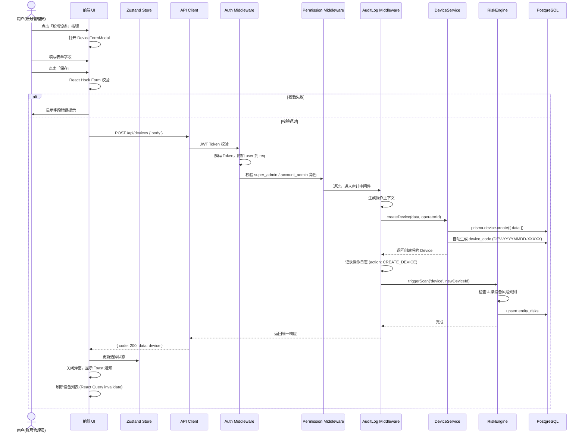
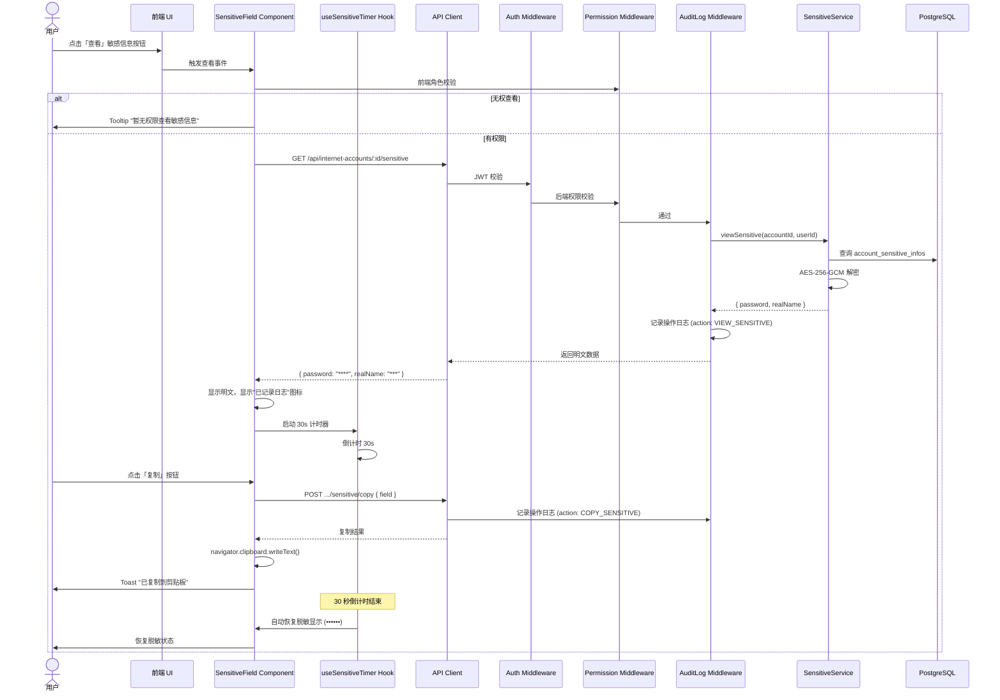
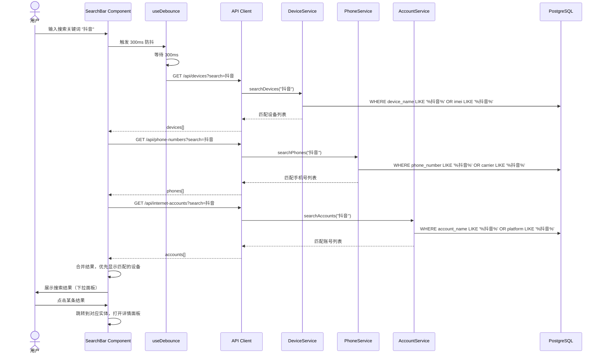

# 公司账号资产管理系统 V1 — 系统架构设计与任务分解

> 版本：V1.0  
> 日期：2026-06-21  
> 基于：requirements-revised.md + DESIGN.md

---

## Part A: System Design

---

### 1. 实现方案

#### 1.1 核心技术挑战

| 挑战 | 说明 | 应对策略 |
|------|------|----------|
| 三层递进数据结构 | 设备→手机号→互联网账号，深度嵌套 | RESTful 三层 API + 前端 Zustand 扁平化缓存 |
| 敏感信息加密与脱敏 | 密码等字段独立分表加密，前端默认 `••••••` | AES-256-GCM 加密 + 30s 自动恢复定时器 |
| 14 条风险规则自动扫描 | 跨三层实体的多规则引擎 | 独立 RiskEngine 服务 + 触发式 + 定时扫描 |
| 固定三栏永不折叠 | 左侧 220px + 中间自适应 + 右侧 380px | CSS Grid 固定宽度 + overflow-x auto |
| 5 种角色权限体系 | 数据可见范围各不相同 | 后端 RBAC 中间件 + 前端 permission hook |
| 无物理删除 | 仅标记 deleted_at / status="已注销" | 全局 Prisma 中间件拦截 delete 操作 |

#### 1.2 技术选型

| 层 | 技术 | 版本 | 理由 |
|---|------|------|------|
| 前端框架 | **React** | ^18.3 | 组件化 + MUI 生态成熟 |
| 构建工具 | **Vite** | ^5.4 | 极速 HMR，TypeScript 原生支持 |
| UI 组件库 | **MUI** (Material UI) | ^5.16 | 丰富的 Table/Modal/Select 组件，减少自定义开发量 |
| CSS 方案 | **Tailwind CSS** | ^3.4 | 配合 DESIGN.md 的 CSS 变量体系，快速实现 Linear 风格 |
| 状态管理 | **Zustand** | ^4.5 | 轻量、无 boilerplate，适合中大型表单/列表状态 |
| 数据请求 | **TanStack React Query** | ^5.0 | 缓存、自动重取、乐观更新与脱敏场景天然配合 |
| 路由 | **React Router** | ^6.24 | 标准 SPA 路由方案 |
| 表单 | **React Hook Form** | ^7.52 | 高性能表单 + MUI 集成 |
| 表格 | **MUI Data Grid** (或自建) | — | 首列固定 + 固定表头 + 横向滚动 |

| 后端框架 | **Express** | ^4.19 | 简明、社区最大、适合内部工具快速开发 |
| 语言 | **TypeScript** | ^5.5 | 前后端类型共享 |
| ORM | **Prisma** | ^5.17 | 类型安全、Migration 自动生成、支持 JSON 字段 |
| 数据库 | **PostgreSQL** | ^16 | JSON 字段支持、事务强大 |
| 认证 | **JWT** (jsonwebtoken) | ^9.0 | 无状态、适合内部系统 |
| 加密 | **Node crypto** (AES-256-GCM) | 内置 | 敏感信息字段级加密 |
| 导入导出 | **xlsx** (SheetJS) | ^0.20 | CSV/Excel 双向支持 |
| 校验 | **Zod** | ^3.23 | 前后端共享 schema 定义 |
| 日志 | **Winston** | ^3.13 | 结构化日志、多 transport |

#### 1.3 整体架构图



#### 1.4 架构模式

- **前端**: 页面级组件 + 共享组件库 + Zustand Store + React Query
- **后端**: 分层架构 (Router → Middleware → Service → ORM)
- **认证**: JWT Token，前端存储于 localStorage，每次请求携带
- **权限**: RBAC (Role-Based Access Control)，权限校验在后端完成

---

### 2. 文件列表

#### 2.1 前端文件

```
frontend/
├── package.json
├── vite.config.ts
├── tsconfig.json
├── tsconfig.node.json
├── tailwind.config.ts
├── postcss.config.js
├── index.html
├── public/
│   └── favicon.svg
├── src/
│   ├── main.tsx                          # 应用入口
│   ├── App.tsx                           # 根组件 + Router Provider
│   ├── vite-env.d.ts
│   │
│   ├── types/                            # 类型定义
│   │   ├── index.ts                      # 聚合导出
│   │   ├── device.ts                     # Device 相关类型
│   │   ├── phone.ts                      # PhoneNumber 相关类型
│   │   ├── account.ts                    # InternetAccount 相关类型
│   │   ├── auth.ts                       # Auth/User/Role 类型
│   │   ├── risk.ts                       # Risk 相关类型
│   │   ├── log.ts                        # OperationLog 类型
│   │   └── api.ts                        # API 响应通用类型
│   │
│   ├── api/                              # API 客户端
│   │   ├── client.ts                     # Axios 实例 + 拦截器
│   │   ├── auth.ts                       # 登录/用户信息 API
│   │   ├── devices.ts                    # 设备 API
│   │   ├── phones.ts                     # 手机号 API
│   │   ├── accounts.ts                   # 互联网账号 API
│   │   ├── sensitive.ts                  # 敏感信息 API
│   │   ├── logs.ts                       # 操作日志 API
│   │   ├── risks.ts                      # 风险 API
│   │   └── admin.ts                      # 系统设置 API
│   │
│   ├── stores/                           # Zustand 状态管理
│   │   ├── authStore.ts                  # 认证/用户角色状态
│   │   ├── selectionStore.ts             # 当前选中实体状态
│   │   └── uiStore.ts                    # UI 状态（面板、弹窗）
│   │
│   ├── hooks/                            # 自定义 Hooks
│   │   ├── useDebounce.ts                # 防抖 hook
│   │   ├── usePermission.ts              # 权限校验 hook
│   │   ├── useSensitiveTimer.ts          # 30s 脱敏恢复定时器
│   │   └── useEntitySearch.ts            # 全局搜索 hook
│   │
│   ├── components/                       # 共享组件
│   │   ├── layout/
│   │   │   ├── MainLayout.tsx            # 三栏布局容器
│   │   │   ├── Sidebar.tsx               # 左侧导航栏
│   │   │   ├── Header.tsx                # 顶部 Header
│   │   │   └── DetailPanel.tsx           # 右侧详情面板容器
│   │   ├── common/
│   │   │   ├── EntityTable.tsx           # 通用表格组件
│   │   │   ├── EntityFormModal.tsx       # 通用表单弹窗
│   │   │   ├── StatusBadge.tsx           # 状态标签
│   │   │   ├── RiskBadge.tsx             # 风险等级标签
│   │   │   ├── SensitiveField.tsx        # 敏感信息脱敏组件
│   │   │   ├── SearchBar.tsx             # 全局搜索框
│   │   │   ├── FilterBar.tsx             # 多条件筛选栏
│   │   │   ├── BatchActionBar.tsx        # 批量操作栏
│   │   │   ├── KpiBar.tsx               # KPI 指标条
│   │   │   ├── BreadCrumb.tsx            # 面包屑导航
│   │   │   ├── ConfirmDialog.tsx         # 确认弹窗
│   │   │   ├── Toast.tsx                 # 操作反馈通知
│   │   │   ├── Skeleton.tsx              # 骨架屏
│   │   │   └── Pagination.tsx            # 分页组件
│   │   └── detail-sections/
│   │       ├── DeviceDetail.tsx          # 设备详情区块集
│   │       ├── PhoneDetail.tsx           # 手机号详情区块集
│   │       ├── AccountDetail.tsx         # 互联网账号详情区块集
│   │       └── SensitiveInfoSection.tsx  # 敏感信息区块
│   │
│   ├── pages/
│   │   ├── AssetPage.tsx                 # 账号资产主页
│   │   ├── LogPage.tsx                   # 操作日志页
│   │   ├── RiskPage.tsx                  # 风险提醒页
│   │   └── SettingsPage.tsx              # 系统设置页
│   │
│   ├── views/
│   │   ├── DeviceListView.tsx            # 设备列表视图
│   │   ├── PhoneListView.tsx             # 手机号列表视图
│   │   └── AccountListView.tsx           # 互联网账号列表视图
│   │
│   ├── modals/
│   │   ├── DeviceFormModal.tsx           # 新增/编辑设备弹窗
│   │   ├── PhoneFormModal.tsx            # 新增/编辑手机号弹窗
│   │   ├── AccountFormModal.tsx          # 新增/编辑账号弹窗
│   │   ├── ImportModal.tsx               # 导入弹窗
│   │   └── TransferOwnerModal.tsx        # 移交负责人弹窗
│   │
│   ├── styles/
│   │   ├── globals.css                   # 全局样式 + CSS 变量
│   │   └── theme.ts                      # MUI 主题覆盖（匹配 DESIGN.md 令牌）
│   │
│   └── utils/
│       ├── formatters.ts                 # 日期/数字格式化
│       ├── validators.ts                 # 表单校验规则（Zod）
│       └── constants.ts                  # 枚举常量、字典数据
```

#### 2.2 后端文件

```
backend/
├── package.json
├── tsconfig.json
├── .env.example                         # 环境变量示例
├── prisma/
│   ├── schema.prisma                    # 数据库模型定义（7 张表 + 3 张关联表）
│   └── migrations/                      # Prisma Migration 目录
│
├── src/
│   ├── index.ts                         # 服务器入口
│   ├── app.ts                           # Express 应用配置
│   │
│   ├── config/
│   │   ├── env.ts                       # 环境变量读取
│   │   ├── crypto.ts                    # AES-256-GCM 工具
│   │   └── jwt.ts                       # JWT 配置
│   │
│   ├── types/
│   │   ├── index.ts                     # 类型聚合导出
│   │   ├── express.d.ts                 # Express Request 扩展（加 user 属性）
│   │   └── enums.ts                     # 枚举定义
│   │
│   ├── middleware/
│   │   ├── auth.ts                      # JWT 认证中间件
│   │   ├── permission.ts                # RBAC 权限校验中间件
│   │   ├── auditLog.ts                  # 操作日志记录中间件
│   │   └── errorHandler.ts              # 全局错误处理
│   │
│   ├── routes/
│   │   ├── index.ts                     # 路由聚合
│   │   ├── auth.ts                      # 认证路由
│   │   ├── devices.ts                   # 设备 CRUD 路由
│   │   ├── phones.ts                    # 手机号 CRUD 路由
│   │   ├── accounts.ts                  # 互联网账号 CRUD 路由
│   │   ├── sensitive.ts                 # 敏感信息查看/复制路由
│   │   ├── logs.ts                      # 操作日志查询路由
│   │   ├── risks.ts                     # 风险查询/扫描路由
│   │   ├── import.ts                    # 导入路由
│   │   ├── export.ts                    # 导出路由
│   │   └── admin.ts                     # 系统设置路由
│   │
│   ├── services/
│   │   ├── deviceService.ts             # 设备业务逻辑
│   │   ├── phoneService.ts              # 手机号业务逻辑
│   │   ├── accountService.ts            # 互联网账号业务逻辑
│   │   ├── sensitiveService.ts          # 敏感信息加解密/日志
│   │   ├── riskEngine.ts                # 风险扫描引擎（14 条规则）
│   │   ├── importService.ts             # 导入服务
│   │   ├── exportService.ts             # 导出服务
│   │   ├── logService.ts                # 操作日志服务
│   │   └── adminService.ts              # 系统设置服务
│   │
│   ├── validators/
│   │   ├── deviceSchema.ts              # 设备表单 Zod schema
│   │   ├── phoneSchema.ts               # 手机号表单 Zod schema
│   │   ├── accountSchema.ts             # 账号表单 Zod schema
│   │   └── querySchema.ts              # 查询参数 Zod schema
│   │
│   └── utils/
│       ├── pagination.ts                # 分页工具
│       ├── response.ts                  # 统一响应格式
│       └── codegen.ts                   # 编号生成器（DEV-/ACC-）
```

---

### 3. 数据结构和接口（类图）

```mermaid
classDiagram
    %% ── 前端类型 ──
    class DeviceDTO {
        +number id
        +string device_code
        +string device_name
        +string brand_model
        +string imei
        +string sim_type  "single | dual"
        +string owner_subject
        +number department_id
        +number owner_user_id
        +number current_user_id
        +string status
        +string risk_level
        +string remark
        +Date created_at
        +Date updated_at
        +PhoneNumberDTO[] phone_numbers
        +string department_name
        +string owner_name
        +string current_user_name
    }

    class PhoneNumberDTO {
        +number id
        +number device_id
        +string slot_type  "sim1 | sim2"
        +string phone_number
        +string carrier
        +boolean is_primary
        +number monthly_fee
        +string plan_type
        +number owner_user_id
        +string status
        +string remark
        +Date created_at
        +Date updated_at
        +string device_name
        +string owner_name
        +InternetAccountDTO[] internet_accounts
    }

    class InternetAccountDTO {
        +number id
        +number phone_number_id
        +string account_code
        +string platform
        +string account_name
        +string login_account
        +string bind_phone
        +string bind_email
        +string owner_subject
        +string purpose
        +number monthly_fee
        +Date expire_at
        +number department_id
        +number owner_user_id
        +number current_user_id
        +string permission_status
        +string status
        +string risk_level
        +string remark
        +Date created_at
        +Date updated_at
        +string department_name
        +string owner_name
        +string current_user_name
    }

    class SensitiveInfoDTO {
        +number id
        +number account_id
        +string login_password  "明文(仅查看时)"
        +string real_name_info  "明文(仅查看时)"
        +Date password_updated_at
        +boolean has_password
        +boolean has_real_name
    }

    class OperationLogDTO {
        +number id
        +number operator_id
        +string operator_name
        +string action_type
        +string target_type
        +number target_id
        +string target_name
        +string before_data
        +string after_data
        +string ip_address
        +string device_info
        +Date created_at
    }

    class RiskDTO {
        +number id
        +string entity_type
        +number entity_id
        +string entity_name
        +string risk_code
        +string risk_title
        +string risk_level
        +string risk_reason
        +string suggestion
        +string status  "open | ignored | resolved"
        +Date detected_at
        +Date resolved_at
    }

    class UserDTO {
        +number id
        +string name
        +string email
        +string phone
        +number department_id
        +string department_name
        +string status
        +string[] roles
    }

    %% ── 后端 Prisma 模型 ──
    class Device {
        +BigInt id
        +String device_code
        +String device_name
        +String brand_model
        +String imei
        +String sim_type
        +String owner_subject
        +BigInt department_id
        +BigInt owner_user_id
        +BigInt current_user_id
        +String status
        +String risk_level
        +String remark
        +BigInt created_by
        +BigInt updated_by
        +DateTime created_at
        +DateTime updated_at
        +DateTime deleted_at
        +PhoneNumber[] phone_numbers
    }

    class PhoneNumber {
        +BigInt id
        +BigInt device_id
        +String slot_type
        +String phone_number
        +String carrier
        +Boolean is_primary
        +Decimal monthly_fee
        +String plan_type
        +BigInt owner_user_id
        +String status
        +String remark
        +DateTime created_at
        +DateTime updated_at
        +Device device
        +InternetAccount[] internet_accounts
    }

    class InternetAccount {
        +BigInt id
        +BigInt phone_number_id
        +String account_code
        +String platform
        +String account_name
        +String login_account
        +String bind_phone
        +String bind_email
        +String owner_subject
        +String purpose
        +String service_provider
        +Decimal monthly_fee
        +DateTime expire_at
        +BigInt department_id
        +BigInt owner_user_id
        +BigInt current_user_id
        +String permission_status
        +String status
        +String risk_level
        +String remark
        +BigInt created_by
        +BigInt updated_by
        +DateTime created_at
        +DateTime updated_at
        +AccountSensitiveInfo sensitive_info
    }

    class AccountSensitiveInfo {
        +BigInt id
        +BigInt account_id
        +String login_password_encrypted
        +String real_name_info_encrypted
        +String backup_info_encrypted
        +DateTime password_updated_at
        +DateTime created_at
        +DateTime updated_at
    }

    class OperationLog {
        +BigInt id
        +BigInt operator_id
        +String action_type
        +String target_type
        +BigInt target_id
        +Json before_data
        +Json after_data
        +String ip_address
        +String device_info
        +String remark
        +DateTime created_at
    }

    class EntityRisk {
        +BigInt id
        +String entity_type
        +BigInt entity_id
        +String risk_code
        +String risk_title
        +String risk_level
        +String risk_reason
        +String suggestion
        +String status
        +DateTime detected_at
        +DateTime resolved_at
    }

    class User {
        +BigInt id
        +String name
        +String email
        +String phone
        +BigInt department_id
        +String status
        +DateTime created_at
        +DateTime updated_at
        +Department department
        +UserRole[] user_roles
    }

    class Department {
        +BigInt id
        +String name
        +BigInt manager_user_id
        +DateTime created_at
        +DateTime updated_at
    }

    class Role {
        +BigInt id
        +String code  "super_admin|boss|account_admin|dept_manager|employee"
        +String name
    }

    class UserRole {
        +BigInt id
        +BigInt user_id
        +BigInt role_id
    }

    %% ── 服务类 ──
    class RiskEngine {
        +runFullScan() RiskResult[]
        +runForEntity(entityType, entityId) RiskResult[]
        +checkDeviceRules(device) RiskResult[]
        +checkPhoneRules(phone) RiskResult[]
        +checkAccountRules(account) RiskResult[]
    }

    class SensitiveService {
        +viewSensitive(accountId, userId) SensitiveResult
        +copySensitive(accountId, field, userId) string
        +updateSensitive(accountId, data) void
        +encrypt(plaintext) string
        +decrypt(ciphertext) string
    }

    %% ── 关系 ──
    Device "1" --> "*" PhoneNumber : has
    PhoneNumber "*" --> "1" Device : belongs to
    PhoneNumber "1" --> "*" InternetAccount : has
    InternetAccount "*" --> "1" PhoneNumber : belongs to
    InternetAccount "1" --> "1" AccountSensitiveInfo : has
    User "1" --> "*" UserRole : has
    UserRole "*" --> "1" Role : assigns
    User "*" --> "1" Department : belongs to

    %% ── 前端路由示例 ──
    class RouteConfig {
        +path "/"
        +component AssetPage
        +requiredRoles all
    }
    class RouteConfig2 {
        +path "/logs"
        +component LogPage
        +requiredRoles super_admin|account_admin|dept_manager
    }
    class RouteConfig3 {
        +path "/risks"
        +component RiskPage
        +requiredRoles super_admin|account_admin
    }
    class RouteConfig4 {
        +path "/settings"
        +component SettingsPage
        +requiredRoles super_admin
    }
```



#### API 端点总览

| 层级 | 方法 | 端点 | 说明 |
|------|------|------|------|
| **认证** | POST | `/api/auth/login` | 登录，返回 JWT |
| | GET | `/api/auth/profile` | 获取当前用户信息+角色 |
| **设备** | GET | `/api/devices` | 设备列表（分页/筛选/搜索） |
| | GET | `/api/devices/:id` | 设备详情（含关联手机号） |
| | POST | `/api/devices` | 新增设备 |
| | PUT | `/api/devices/:id` | 编辑设备 |
| | DELETE | `/api/devices/:id` | 软删除设备 |
| | GET | `/api/devices/stats` | KPI 统计数字 |
| **手机号** | GET | `/api/phone-numbers` | 手机号列表 |
| | GET | `/api/phone-numbers/:id` | 手机号详情（含关联账号） |
| | POST | `/api/phone-numbers` | 新增手机号 |
| | PUT | `/api/phone-numbers/:id` | 编辑手机号 |
| | DELETE | `/api/phone-numbers/:id` | 软删除 |
| **互联网账号** | GET | `/api/internet-accounts` | 账号列表 |
| | GET | `/api/internet-accounts/:id` | 账号详情 |
| | POST | `/api/internet-accounts` | 新增账号 |
| | PUT | `/api/internet-accounts/:id` | 编辑账号 |
| | DELETE | `/api/internet-accounts/:id` | 软删除 |
| | POST | `/api/internet-accounts/batch` | 批量操作 |
| **敏感信息** | GET | `/api/internet-accounts/:id/sensitive` | 查看敏感信息（写日志） |
| | POST | `/api/internet-accounts/:id/sensitive/copy` | 复制敏感信息（写日志） |
| | PUT | `/api/internet-accounts/:id/sensitive` | 修改敏感信息 |
| **日志** | GET | `/api/operation-logs` | 操作日志列表（分页/筛选） |
| **风险** | GET | `/api/risks` | 风险列表 |
| | PUT | `/api/risks/:id` | 更新风险状态 |
| | POST | `/api/risks/scan` | 触发全量风险扫描 |
| **导入导出** | POST | `/api/import/preview` | 导入预览 |
| | POST | `/api/import` | 执行导入 |
| | GET | `/api/export` | 导出数据（按视图+筛选） |
| **系统设置** | GET | `/api/admin/users` | 用户列表 |
| | POST | `/api/admin/users` | 新增用户 |
| | PUT | `/api/admin/users/:id` | 编辑用户 |
| | GET | `/api/admin/departments` | 部门列表 |
| | POST | `/api/admin/departments` | 新增部门 |
| | PUT | `/api/admin/departments/:id` | 编辑部门 |
| | GET | `/api/admin/roles` | 角色列表 |
| | GET | `/api/admin/dict/:type` | 字典项查询 |

**统一响应格式**：
```json
{
  "code": 200,
  "data": { ... },
  "message": "success",
  "pagination": { "page": 1, "pageSize": 50, "total": 1284 }
}
```

---

### 4. 程序调用流程（时序图）

#### 4.1 新增设备流程



#### 4.2 查看敏感信息流程



#### 4.3 全局搜索流程



---

### 5. 未明确事项

| 序号 | 问题 | 当前假设 |
|------|------|----------|
| 1 | **用户认证方式**：缺少登录页面设计 | 假设使用普通用户名+密码认证，JWT Token |
| 2 | **密码设置策略**：新增账号时的密码流程 | 假设创建账号时不填密码，创建后可进入敏感信息区编辑 |
| 3 | **"已注销"后的数据展示**：软删除后是否在列表中默认隐藏 | 假设列表默认不显示"已注销"项，可通过筛选查看 |
| 4 | **风险规则中密码过期**：V1 标记但 V3 启用，如何标记 | 假设 V1 只检测密码修改时间字段是否为空（未设置过密码也生成风险） |
| 5 | **批量导入的 Sheet 关联方式**：设备→手机号通过 device_code | 假设用设备编号关联、手机号原文关联，无 ID 时先创建再引用 |
| 6 | **前端 MUI Data Grid vs 自建 Table** | 假设使用自建 Table 组件（基于 MUI Table），以便精确控制首列固定等细节 |
| 7 | **文件上传大小限制** | 假设 CSV/Excel 文件不超过 10MB |

---

## Part B: Task Decomposition

---

### 6. 所需依赖包

#### 6.1 前端依赖

```
前端 (package.json):
react@^18.3.1                  # UI 框架
react-dom@^18.3.1              # React DOM
react-router-dom@^6.24.0       # 路由
@mui/material@^5.16.0          # MUI 组件库
@mui/icons-material@^5.16.0    # MUI 图标
@emotion/react@^11.11.0        # MUI CSS-in-JS 运行时
@emotion/styled@^11.11.0       # MUI 样式
tailwindcss@^3.4.0             # Tailwind CSS
zustand@^4.5.0                 # 状态管理
@tanstack/react-query@^5.0.0   # 数据请求/缓存
react-hook-form@^7.52.0        # 表单处理
zod@^3.23.0                    # 校验
axios@^1.7.0                   # HTTP 客户端
xlsx@^0.20.0                   # Excel 读写
dayjs@^1.11.0                  # 日期处理
clsx@^2.1.0                    # classnames 工具

开发依赖:
typescript@^5.5.0
vite@^5.4.0
@vitejs/plugin-react@^4.3.0
tailwindcss@^3.4.0
postcss@^8.4.0
autoprefixer@^10.4.0
@types/react@^18.3.0
@types/react-dom@^18.3.0
```

#### 6.2 后端依赖

```
后端 (package.json):
express@^4.19.0                # Web 框架
typescript@^5.5.0              # TypeScript
ts-node@^10.9.0                # TS 运行时
prisma@^5.17.0                 # ORM
@prisma/client@^5.17.0         # Prisma 客户端
jsonwebtoken@^9.0.0            # JWT
bcryptjs@^2.4.3                # 密码哈希
zod@^3.23.0                    # 校验
xlsx@^0.20.0                   # Excel 读写
multer@^1.4.5-lts.1            # 文件上传
winston@^3.13.0                # 日志
cors@^2.8.5                    # CORS
dotenv@^16.4.0                 # 环境变量
helmet@^7.1.0                  # 安全头
express-rate-limit@^7.2.0      # 限流

开发依赖:
@types/express@^4.17.0
@types/jsonwebtoken@^9.0.0
@types/bcryptjs@^2.4.0
@types/multer@^1.4.0
@types/cors@^2.8.0
tsx@^4.7.0                     # TS 执行（开发用）
nodemon@^3.1.0                 # 热重载
```

---

### 7. 任务列表（按依赖顺序）

#### T01: 项目基础设施搭建

| 属性 | 值 |
|------|-----|
| **Task ID** | T01 |
| **名称** | 项目基础设施搭建 |
| **优先级** | P0 |
| **依赖** | 无 |
| **预估工作量** | 1.5 天 |

**涉及文件**：
```
frontend/package.json
frontend/vite.config.ts
frontend/tsconfig.json
frontend/tsconfig.node.json
frontend/tailwind.config.ts
frontend/postcss.config.js
frontend/index.html
frontend/src/main.tsx
frontend/src/vite-env.d.ts
frontend/src/App.tsx
frontend/src/styles/globals.css        # CSS 变量 + Tailwind 指令
frontend/src/styles/theme.ts           # MUI 主题（对齐 DESIGN.md）
frontend/src/utils/constants.ts        # 枚举常量
backend/package.json
backend/tsconfig.json
backend/.env.example
backend/prisma/schema.prisma           # 完整 10 张表定义
backend/src/index.ts                   # 服务入口
backend/src/app.ts                     # Express 应用配置
backend/src/config/env.ts              # 环境变量读取
```

**具体内容**：
1. 初始化前端项目（Vite + React + TypeScript）
2. 配置 Tailwind CSS + PostCSS
3. 编写 globals.css 注入全部 DESIGN.md CSS 变量
4. 创建 MUI 主题 theme.ts 对齐 Linear 蓝灰令牌
5. 配置 tsconfig 路径别名（`@/` → `src/`）
6. 创建主入口 main.tsx 和 App.tsx 空壳
7. 初始化后端 Node.js + TypeScript 项目
8. 配置 Prisma schema 定义全部 10 张表（users, departments, roles, user_roles, devices, phone_numbers, internet_accounts, account_sensitive_infos, operation_logs, entity_risks）
9. 配置 Express 基础框架 + CORS + 错误处理
10. 配置环境变量模板
11. 定义 constants.ts 中所有枚举字典（平台类型、状态枚举、风险等级等）

---

#### T02: 数据层 — 类型定义 + API 客户端 + 状态管理 + 后端 ORM CRUD

| 属性 | 值 |
|------|-----|
| **Task ID** | T02 |
| **名称** | 数据层：类型、API、状态管理、后端 CRUD |
| **优先级** | P0 |
| **依赖** | T01 |
| **预估工作量** | 2 天 |

**涉及文件**：
```
frontend/src/types/index.ts
frontend/src/types/device.ts
frontend/src/types/phone.ts
frontend/src/types/account.ts
frontend/src/types/auth.ts
frontend/src/types/risk.ts
frontend/src/types/log.ts
frontend/src/types/api.ts
frontend/src/api/client.ts
frontend/src/api/auth.ts
frontend/src/api/devices.ts
frontend/src/api/phones.ts
frontend/src/api/accounts.ts
frontend/src/api/sensitive.ts
frontend/src/api/logs.ts
frontend/src/api/risks.ts
frontend/src/api/admin.ts
frontend/src/stores/authStore.ts
frontend/src/stores/selectionStore.ts
frontend/src/stores/uiStore.ts
backend/src/types/index.ts
backend/src/types/enums.ts
backend/src/types/express.d.ts
backend/src/config/crypto.ts
backend/src/config/jwt.ts
backend/src/middleware/auth.ts
backend/src/middleware/permission.ts
backend/src/middleware/auditLog.ts
backend/src/middleware/errorHandler.ts
backend/src/utils/pagination.ts
backend/src/utils/response.ts
backend/src/utils/codegen.ts
backend/src/services/deviceService.ts       # CRUD 基础
backend/src/services/phoneService.ts        # CRUD 基础
backend/src/services/accountService.ts      # CRUD 基础
backend/src/services/logService.ts
backend/src/services/adminService.ts
backend/src/validators/deviceSchema.ts
backend/src/validators/phoneSchema.ts
backend/src/validators/accountSchema.ts
backend/src/validators/querySchema.ts
```

**具体内容**：
1. 定义前端完整 TypeScript 类型（DTO + API 响应类型）
2. 创建 Axios 实例 + 拦截器（Token 注入、错误统一处理）
3. 实现全部 API 客户端函数
4. 创建 Zustand stores（authStore 用户/角色状态、selectionStore 选中实体、uiStore 面板/弹窗控制）
5. 后端 Prisma service CRUD（不含敏感信息业务逻辑）
6. 实现 JWT 认证中间件 + RBAC 权限中间件
7. 实现审计日志中间件（记录所有写操作）
8. 实现 Zod 校验 schema（前后端共享校验规则）
9. 实现分页/统一响应/编号生成器工具函数
10. 实现 AES-256-GCM 加密解密工具

---

#### T03: 核心业务页面 — 三栏布局 + 三种视图 + 表格 + 详情面板 + 弹窗

| 属性 | 值 |
|------|-----|
| **Task ID** | T03 |
| **名称** | 核心业务页面与交互 |
| **优先级** | P0 |
| **依赖** | T02 |
| **预估工作量** | 3 天 |

**涉及文件**：
```
frontend/src/components/layout/MainLayout.tsx
frontend/src/components/layout/Sidebar.tsx
frontend/src/components/layout/Header.tsx
frontend/src/components/layout/DetailPanel.tsx
frontend/src/components/common/EntityTable.tsx
frontend/src/components/common/StatusBadge.tsx
frontend/src/components/common/RiskBadge.tsx
frontend/src/components/common/SearchBar.tsx
frontend/src/components/common/FilterBar.tsx
frontend/src/components/common/BatchActionBar.tsx
frontend/src/components/common/KpiBar.tsx
frontend/src/components/common/BreadCrumb.tsx
frontend/src/components/common/Pagination.tsx
frontend/src/components/common/Skeleton.tsx
frontend/src/components/common/Toast.tsx
frontend/src/components/common/ConfirmDialog.tsx
frontend/src/components/detail-sections/DeviceDetail.tsx
frontend/src/components/detail-sections/PhoneDetail.tsx
frontend/src/components/detail-sections/AccountDetail.tsx
frontend/src/pages/AssetPage.tsx
frontend/src/pages/LogPage.tsx
frontend/src/pages/RiskPage.tsx
frontend/src/pages/SettingsPage.tsx
frontend/src/views/DeviceListView.tsx
frontend/src/views/PhoneListView.tsx
frontend/src/views/AccountListView.tsx
frontend/src/modals/DeviceFormModal.tsx
frontend/src/modals/PhoneFormModal.tsx
frontend/src/modals/AccountFormModal.tsx
frontend/src/hooks/useDebounce.ts
frontend/src/hooks/usePermission.ts
frontend/src/hooks/useEntitySearch.ts
frontend/src/utils/formatters.ts
backend/src/routes/index.ts
backend/src/routes/devices.ts
backend/src/routes/phones.ts
backend/src/routes/accounts.ts
backend/src/routes/logs.ts
backend/src/routes/risks.ts
backend/src/routes/admin.ts
```

**具体内容**：
1. 实现固定三栏布局 MainLayout（左侧 220px 导航 + 中间自适应 + 右侧 380px 详情面板）
2. 左侧导航栏 Sidebar（4 个激活项 + V2/V3 禁用项带"即将上线"标签）
3. 顶部 Header（面包屑 + 用户信息）
4. 通用表格 EntityTable（固定表头 + 首列固定 + 横向滚动 + 多选 + 排序 + 分页）
5. 三种视图组件（DeviceListView / PhoneListView / AccountListView）
6. 四种状态/风险标签（StatusBadge / RiskBadge）
7. 全局搜索框 SearchBar（300ms 防抖）
8. 多条件筛选栏 FilterBar（6 个筛选维度）
9. 批量操作栏 BatchActionBar
10. KPI 指标条 KpiBar
11. 右侧详情面板容器 + 三个实体详情区块（DeviceDetail/PhoneDetail/AccountDetail）
12. 面包屑导航 BreadCrumb（设备名 > 手机号 > 账号名）
13. 新增/编辑弹窗（DeviceFormModal / PhoneFormModal / AccountFormModal — React Hook Form + Zod 校验）
14. 确认弹窗 ConfirmDialog
15. Toast 通知组件
16. 骨架屏 Skeleton 组件
17. 分页组件 Pagination
18. 4 个页面组件（AssetPage / LogPage / RiskPage / SettingsPage）
19. 后端路由注册（全部 CRUD 路由 + 统一挂载）

---

#### T04: 敏感信息脱敏 + 权限体系 + 风险引擎 + 辅助功能

| 属性 | 值 |
|------|-----|
| **Task ID** | T04 |
| **名称** | 敏感信息脱敏组件 + 权限体系 + 风险引擎 + 辅助功能 |
| **优先级** | P0 |
| **依赖** | T03 |
| **预估工作量** | 2.5 天 |

**涉及文件**：
```
frontend/src/components/common/SensitiveField.tsx
frontend/src/components/detail-sections/SensitiveInfoSection.tsx
frontend/src/hooks/useSensitiveTimer.ts
frontend/src/modals/TransferOwnerModal.tsx
frontend/src/modals/ImportModal.tsx
backend/src/routes/sensitive.ts
backend/src/routes/import.ts
backend/src/routes/export.ts
backend/src/services/sensitiveService.ts
backend/src/services/riskEngine.ts
backend/src/services/importService.ts
backend/src/services/exportService.ts
```

**具体内容**：
1. **敏感信息脱敏组件 SensitiveField**：
   - 默认显示 `••••••`（灰底灰字）
   - 查看按钮 → 权限校验 → 解密显示 → 写入操作日志
   - 复制按钮 → 权限校验 → 剪贴板写入 → 写入操作日志
   - 30 秒自动恢复脱敏（useSensitiveTimer hook）
   - 无权限时隐藏按钮 + tooltip "暂无权限查看敏感信息"
2. **敏感信息区块 SensitiveInfoSection**（集成在 AccountDetail 中）
3. **风险引擎 RiskEngine**（后端服务）：
   - 实现全部 14 条风险规则
   - 支持按实体触发扫描 + 全量扫描
   - 自动写入 entity_risks 表
   - 触发时机：新增/编辑/导入/修改负责人/修改状态
4. **导入导出**：
   - ImportModal（文件上传 → 预览映射 → 确认导入 → 结果展示）
   - 后端 importService（三层顺序导入 + 事务回滚）
   - 后端 exportService（按视图 + 权限导出）
5. **后端敏感信息路由** + API 端点对接

---

#### T05: 路由集成 + 最终联调 + 辅助页面完善

| 属性 | 值 |
|------|-----|
| **Task ID** | T05 |
| **名称** | 路由集成、联调与页面完善 |
| **优先级** | P1 |
| **依赖** | T04 |
| **预估工作量** | 1.5 天 |

**涉及文件**：
```
frontend/src/App.tsx                       # 路由配置更新
frontend/src/pages/AssetPage.tsx           # 集成完善
frontend/src/pages/LogPage.tsx             # 集成完善
frontend/src/pages/RiskPage.tsx            # 集成完善
frontend/src/pages/SettingsPage.tsx        # 集成完善
frontend/src/hooks/usePermission.ts        # 权限钩子完善
frontend/src/components/common/EntityTable.tsx  # 最终打磨
frontend/src/components/layout/DetailPanel.tsx   # 最终打磨
backend/src/routes/index.ts                # 路由聚合最终检查
backend/src/middleware/permission.ts        # 权限种子数据
```

**具体内容**：
1. 配置完整 React Router 路由（4 个页面 + 路由守卫 + 未授权页）
2. 路由守卫集成 usePermission hook，5 种角色路由级校验
3. 风险提醒页集成：风险列表 + 点击跳转详情面板 + 忽略/解决操作
4. 操作日志页集成：日志表格 + 4 维筛选 + 展开查看详情
5. 系统设置页集成：用户管理 CRUD + 角色管理 + 部门管理 + 字典管理
6. 所有页面间导航联动（风险页点击实体跳转到资产页对应详情）
7. 权限种子数据脚本（初始化 5 种角色 + 超级管理员账号）
8. 最终联调：前后端全链路测试
9. 边界情况处理：空状态、加载态、错误态、权限不足态

---

### 8. 任务依赖关系图


| 任务 | 依赖 | 说明 |
|------|------|------|
| T01 | 无 | 脚手架先行 |
| T02 | T01 | 类型/API/Store/ORM 依赖项目基础 |
| T03 | T02 | 页面组件依赖 API 和数据状态 |
| T04 | T03 | 敏感信息和风险引擎需在核心页面框架之上集成 |
| T05 | T04 | 联调与路由集成在所有功能模块完成后进行 |

---

### 9. 共享知识（跨文件约定）

| 类别 | 约定 |
|------|------|
| **API 响应格式** | `{ code: number, data: T \| T[], message: string, pagination?: { page, pageSize, total } }` |
| **认证方式** | JWT Token，前端存储在 `localStorage`，通过 `Authorization: Bearer <token>` 传递 |
| **权限校验** | 后端 RBAC 中间件做最终校验，前端 usePermission hook 做 UI 隐藏/禁用 |
| **命名规范** | 前端：PascalCase 组件名，camelCase 变量/函数；后端：camelCase 变量，PascalCase 类 |
| **日期格式** | 全部使用 ISO 8601 UTC 格式存储和传输，前端用 dayjs 格式化显示 |
| **软删除** | 无物理 DELETE 操作，全部通过 `deleted_at` 或 `status='已注销'` 标记 |
| **分页** | 默认 page=1, pageSize=50，所有列表接口支持分页参数 |
| **搜索防抖** | 全局搜索 300ms 防抖，通过 useDebounce hook 实现 |
| **脱敏超时** | 敏感信息查看后 30s 自动恢复 `••••••`，通过 useSensitiveTimer hook 管理 |
| **操作日志** | 所有写操作（增/删/改/敏感查看/导入导出）均通过 auditLog 中间件自动记录 |
| **错误处理** | 前端统一通过 Axios 拦截器处理错误，后端通过 errorHandler 中间件返回统一错误格式 |
| **枚举字典** | 前端 constants.ts 和后端 enums.ts 保持一致，平台类型/状态/风险等级等枚举值统一 |
| **UI 约束** | 固定三栏永不折叠；不使用斑马行；红色仅用于高风险标识；纯黑文字用 `#1F2937` 替代 |
| **组件通信** | 跨组件状态走 Zustand Store，数据请求走 React Query，父子组件传 Props |
| **CORS** | 后端配置 CORS 允许前端开发服务器地址（localhost:5173） |

---

### 10. 总结

本设计文档覆盖了公司账号资产管理系统 V1 的完整架构设计与任务分解：

- **前端**：React 18 + TypeScript + Vite + MUI + Tailwind CSS + Zustand
- **后端**：Node.js + Express + TypeScript + Prisma + PostgreSQL
- **共 5 个实现任务**，总预估工作量 **10 天**（单人全栈开发）
- **任务按严格依赖顺序排列**，每个任务包含 3+ 文件
- **所有 14 条风险规则** 在 RiskEngine 中实现
- **敏感信息安全** 通过 AES-256-GCM 加密 + 独立分表 + 30s 自动脱敏 + 审计日志四重保障
